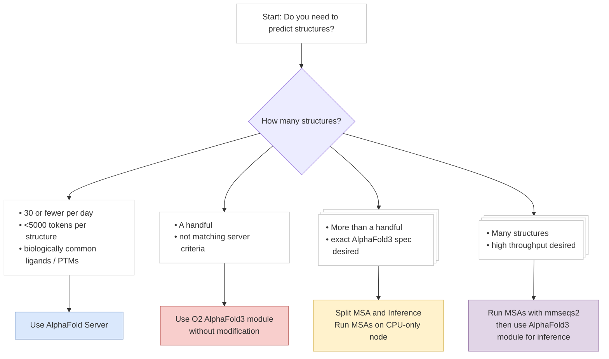

# AlphaFold3 on O2 Workshop

Welcome to the AlphaFold3 Workshop!

AlphaFold3 significantly advances protein structure prediction beyond AlphaFold2, offering greater accuracy and broader capabilities.

### Setup

To begin, we'll set up a reproducible Python environment with all required packages. We’ll use [uv](https://docs.astral.sh/uv/), a fast Python project manager written in Rust, to restore the virtual environment for `ccbfold`—a custom Python package developed for this workshop.

```bash
# install uv package manager
curl -LsSf https://astral.sh/uv/install.sh | sh

# add to PATH
source $HOME/.local/bin/env

# download ccbfold repo
git clone https://github.com/ccb-hms/ccbfold.git
cd ccbfold

# restore venv and activate
uv sync
source .venv/bin/activate

# create and move to directory for workshop
mkdir ../af3_workshop
cd ../af3_workshop
```

### Exercise 1: Hello Alphafold3


To get started, we'll use a simple example involving a DNA-binding protein and gene-editing meganuclease, along with its the DNA sequence that it binds to. A crystal structure for this complex is available in [PDB entry 7RCE](https://www.rcsb.org/structure/7RCE).

First, create the necessary input file for AlphaFold3:

```bash
mkdir 01_basic
cd 01_basic
nano pdb_7rce_input.json

# to paste: Ctrl (Cmd on Mac) + Shift + v
# to save: Ctrl (Cmd on Mac) + o then Enter
# to exit nano: Ctrl (Cmd on Mac) + x
```

Paste the following content into the file:

```json
{
    "name": "Protein-DNA-Ion: PDB 7RCE",
    "modelSeeds": [1],
    "sequences": [
      {
        "protein": {
          "id": "A",
          "sequence": "MASSRRESINPWILTGFADAEGSFGLSILNRNRGTARYHTRLSFTIMLHNKDKSILENIQSTWKVGSILNNGDHYVSLVVYRFEDLKVIIDHFEKYPLITQKLGDYKLFKQAFSVMENKEHLKENGIKELVRIKAKMNWGLNDELKKAFPENISKERPLINKNIPNFKWLAGFTSGDGSFFVRLRKSNVNARVRVQLVFEISQHIRDKNLMNSLITYLGCGHIYEGNKSERSWLQFRVEKFSDINDKIIPVFQENTLIGVKLEDFEDWCKVAKLIEEKKHLTESGLDEIKKIKLNMNKGR"
        }
      },
      {
        "dna": {
          "id": "B",
          "sequence": "GGGGGCATGCAGATCCCACAGGCGCG"
        }
      },
      {
        "ligand": {
          "id": ["C", "D", "E"],
          "ccdCodes": ["CA"]
        }
      },
      {
        "ligand": {
          "id": "F",
          "ccdCodes": ["NA"]
        }
      }
    ],
    "dialect": "alphafold3",
    "version": 2
}
```


Next, create a Slurm submission script to run AlphaFold3:

```bash
nano pdb_7rce_submit.sh
```

Paste in the following:

```bash
#!/bin/bash
#SBATCH -c 20                    # Request 20 cores
#SBATCH --mem=64G                # Memory total in GiB
#SBATCH --partition=gpu_quad     # Partition to run in
#SBATCH -o pdb_7rce_%j.out       # File to which STDOUT will be written, including job ID (%j)
#SBATCH -e pdb_7rce_%j.err       # File to which STDERR will be written, including job ID (%j)
#SBATCH --gres=gpu:l40s:1        # GPU requested
#SBATCH -t 0-01:00               # Runtime in D-HH:MM format

module load alphafold/3.0.1

run_alphafold.py \
   --json_path=pdb_7rce_input.json \
   --output_dir=pdb_7rce_output
```

Now you're ready to submit your first AlphaFold3 prediction job:

```bash
# NOTE: may need to specify account, e.g.:
# sbatch -A zaklab pdb_7rce_submit.sh
sbatch pdb_7rce_submit.sh
```

### Exercise 2: Running a Batch of Jobs

If you want to generate structures for many different protein-ligand pairs, setting up input files one at a time quickly becomes tedious. Instead, we can use a Python utility called `af3cli` to programmatically generate input JSONs.

All of the sequences and corresponding small molecules are stored in a tab-separated file like this:

|   Symbol   |   ProteinSequence                            |   Compound  |   SMILES                                        |
|------------|----------------------------------------------|-------------|-------------------------------------------------|
|   RREB1    | MTSSSPAGLEGSDLSSINTMMSAVMSVGKVTENGGSPQ... |   E1879     |   Cn1c(CNC=C(C#N)C(=O)Nc2ccccc2)cc(=O)n(C)c1=O  |
|   SEPTIN5  | MSTGLRYKSKLATPEDKQDIDKQYVGFATLPNQVHRKSV... |   E2964     |   CN(C)c1nc(ncc1NC(=O)CCl)N2CCOCC2              |
|   ATP6V1A  | MDFSKLPKILDEDKESTFGYVHGVSGPVVTACDMAGAAM... |   CL117     |   NC(=O)C=1C=CC=CC1NC(=O)CCl                    |
|   ...  | ... |   ...     |   ...                  |

Our job is to predict the structure of each protein sequence in complex with its associated small molecule, using the provided SMILES string as the ligand.

Start by setting up a directory and writing the script that converts the above TSV into AlphaFold3-compatible inputs:

```bash
# go up one directory if still in 01_basic/
cd ..
mkdir 02_batch_of_jobs
cd 02_batch_of_jobs
nano step1_generate_af3_inputs.py
```

Paste the following script:

```python
import csv
from pathlib import Path
from af3cli import InputBuilder, ProteinSequence, SMILigand

# Constants
INPUT_FILE = "../data/preliminaryTests.tsv"
OUTPUT_DIR = Path("af3_inputs")
OUTPUT_DIR.mkdir(exist_ok=True)

# Read the TSV file
with open(INPUT_FILE, newline='', encoding='utf-8') as f:
    reader = csv.DictReader(f, delimiter='\t')
    for row in reader:
        # Extract data from each row
        symbol = row["Symbol"]
        compound = row["Compound"]
        sequence_str = row["ProteinSequence"]
        smiles_str = row["SMILES"]

        # Construct job name and output filename
        job_name = f"{symbol}_{compound}"
        filename = OUTPUT_DIR / f"{job_name}.json"

        # Build AF3 input
        sequence = ProteinSequence(seq_str=sequence_str)
        ligand = SMILigand(ligand_value=smiles_str)
        input_builder = InputBuilder()
        input_builder.set_name(job_name)
        input_builder.add_sequence(sequence)
        input_builder.add_ligand(ligand)
        input_builder.set_version(2)
        input_builder.set_seeds([1])
        internal_input = input_builder.build()

        # Write to file
        internal_input.write(filename)

```

Before running this script, download the input dataset:

```bash
mkdir ../data
curl -L -o ../data/preliminaryTests.tsv "https://raw.githubusercontent.com/ccb-hms/ccbfold/refs/heads/main/examples/workshop/data/preliminaryTests.tsv"
```

Now generate the input JSON files:

```python
# will save .json files to af3_inputs/
python step1_generate_af3_inputs.py
```

To submit all of the jobs to the cluster at once, we’ll take advantage of Slurm’s job arrays:


```bash
nano step2_submit_batch.sh
```

Paste the following script:

```bash
#!/bin/bash
#SBATCH -c 20                    # Request 20 cores
#SBATCH --mem=64G                # Memory total in GiB
#SBATCH --partition=gpu_quad     # Partition to run in
#SBATCH -o logs/af3_job_%A_%a.out       # STDOUT file
#SBATCH -e logs/af3_job_%A_%a.err       # STDERR file
#SBATCH --gres=gpu:l40s:1        # GPU requested
#SBATCH -t 0-01:00               # Runtime in D-HH:MM
#SBATCH --array=0-9              # Job array indices (for 10 .json files)

module load alphafold/3.0.1

# Get the input json file
INPUT_DIR="af3_inputs"
INPUT_FILES=(${INPUT_DIR}/*.json)
INPUT_FILE=${INPUT_FILES[$SLURM_ARRAY_TASK_ID]}

# Derive job name and output directory from file name
JOB_NAME=$(basename "$INPUT_FILE" .json)
OUTPUT_DIR="af3_outputs"

# Make sure output directory exists
mkdir -p "$OUTPUT_DIR"

run_alphafold.py \
   --json_path="$INPUT_FILE" \
   --output_dir="$OUTPUT_DIR"
```

And submit the batch job array like so:

```bash
sbatch step2_submit_batch.sh
```

### Exercise 3: Separate MSA and Inference

When running AlphaFold3, the majority of execution time — often more than 80% — is spent creating the multiple sequence alignment (MSA), a step that only uses CPUs. To better utilize GPU resources, we can split the run into two phases: first run MSA, and then run inference separately.

Set up the directory and copy over inputs from the previous exercise:

```bash
cd ..
mkdir 03_separate_msa
cd 03_separate_msa

# copy over af3_inputs from exercise 2
cp -R ../02_batch_of_jobs/af3_inputs .
```

Create a Slurm script to run only the MSA step:

```bash
nano step2_submit_msa_batch.sh
```

Save the following:

```bash
#!/bin/bash
#SBATCH -c 20                    # Request 20 cores
#SBATCH --mem=64G                # Memory total in GiB
#SBATCH --partition=short        # Partition to run in
#SBATCH -o logs/af3_msa_job_%A_%a.out       # STDOUT file
#SBATCH -e logs/af3_msa_job_%A_%a.err       # STDERR file
#SBATCH -t 0-01:00               # Runtime in D-HH:MM
#SBATCH --array=0-9              # Job array indices (for 10 .json files)

module load alphafold/3.0.1

# Get the input json file
INPUT_DIR="af3_inputs"
INPUT_FILES=(${INPUT_DIR}/*.json)
INPUT_FILE=${INPUT_FILES[$SLURM_ARRAY_TASK_ID]}


# Make sure output directory exists
OUTPUT_DIR="af3_msa_outputs"
mkdir -p "$OUTPUT_DIR"

# Run AlphaFold3 MSA only
run_alphafold.py \
   --json_path="$INPUT_FILE" \
   --output_dir="$OUTPUT_DIR" \
   --norun_inference
```

Note that the submission script has the following changes:
- adds `--norun_data_pipeline` flag so that AlphaFold3 only runs MSA
- we save the MSA results to `af3_msa_outputs`
- we no longer need a GPU so we use the `short` partition and remove the `--gres` flag

Go ahead and submit your MSA job:

```bash
sbatch step2_submit_msa_batch.sh
#Submitted batch job <JOB_ID_HERE>
```

Let's save the job ID from the MSA step so we can make the inference step wait until it has successfully completed:

```bash
MSA_JOB_ID=<JOB_ID_HERE>
```

Now for the inference step, we need another batch script that picks up where the MSA step left off:

```bash
nano step3_submit_inference_batch.sh
```

Paste this:

```bash
#!/bin/bash
#SBATCH -c 2                     # Request 4 cores
#SBATCH --mem=16G                # Memory total in GiB
#SBATCH --partition=gpu_quad     # Partition to run in
#SBATCH -o logs/af3_inference_job_%A_%a.out       # STDOUT file
#SBATCH -e logs/af3_inference_job_%A_%a.err       # STDERR file
#SBATCH --gres=gpu:l40s:1        # GPU requested
#SBATCH -t 0-01:00               # Runtime in D-HH:MM
#SBATCH --array=0-9              # Job array indices (for 10 .json files)

module load alphafold/3.0.1

# Get the input json file with MSA created in step 2
INPUT_DIR="af3_msa_outputs"
JOB_NAMES=($(ls "${INPUT_DIR}"))
JOB_NAME=${JOB_NAMES[$SLURM_ARRAY_TASK_ID]}
INPUT_FILE="${INPUT_DIR}/${JOB_NAME}/${JOB_NAME}_data.json"

# Derive job name and output directory from file name
OUTPUT_DIR="af3_inference_outputs"
JOB_OUTPUT_DIR="${OUTPUT_DIR}/${JOB_NAME}"

# Make sure output directory exists
mkdir -p "$OUTPUT_DIR"

# Run AlphaFold3 Inference only
run_alphafold.py \
   --json_path="$INPUT_FILE" \
   --output_dir="$JOB_OUTPUT_DIR" \
   --norun_data_pipeline
```

Note the following changes:
- added `--norun_data_pipeline` flag so AlphaFold3 only runs inference step
- our `INPUT_FILE` for each submission is the output of the MSA step instead of the original JSON
- we save our final results to `af3_inference_outputs`
- we don't request much CPU or RAM, as inference is mostly GPU-bound

You can now submit the inference step, making sure to run it only after the MSA jobs complete:

```bash
sbatch --dependency=afterok:$MSA_JOB_ID step3_submit_inference_batch.sh
```

### Exercise 4: Run MSAs on GPU with mmseqs2

Previously, we split MSA and inference execution to reduce wasted GPU time. In this exercise, we’ll take it a step further and use `mmseqs2`, which includes GPU acceleration for MSA generation, allowing throughput improvements of ~10x as compared to `jackhmmer`.

We’ll start by generating a `.fasta` file with all protein sequences:

```bash
cd ..
mkdir 04_mmseqs2_msa
cd 04_mmseqs2_msa
nano step1_generate_colabfold_msa_input.py
```

Paste the following python script into this file and save it:

```python
import csv

# Constants
INPUT_FILE = "../data/preliminaryTests.tsv"
OUTPUT_FILE = "../data/preliminaryTests.fasta"

with open(INPUT_FILE, 'r') as input_tsv, open(OUTPUT_FILE, 'w') as output_fasta:
    input_reader = csv.DictReader(input_tsv, delimiter='\t')
    for row in input_reader:

        # Extract data from each row
        symbol = row["Symbol"]
        compound = row["Compound"]
        sequence_str = row["ProteinSequence"]

        # Add sequence to output fasta
        output_fasta.write(f">{symbol}_{compound}\n")
        output_fasta.write(f"{sequence_str}\n")

```

Run it to create the `preliminaryTests.fasta` file:

```bash
python step1_generate_colabfold_msa_input.py
```

Now create the submission script to run `mmseqs2` on GPU:

```bash
nano step2_submit_colabfold_msa.sh
```

Paste this:

```bash
#!/bin/bash
#SBATCH -c 20                    # Request 20 cores
#SBATCH --mem=64G                # Memory total in GiB
#SBATCH --partition=gpu_quad     # Partition to run in
#SBATCH -o logs/colabfold_msa_job_%A_%a.out       # STDOUT file
#SBATCH -e logs/colabfold_msa_job_%A_%a.err       # STDERR file
#SBATCH --gres=gpu:l40s:1        # GPU requested
#SBATCH -t 0-01:00               # Runtime in D-HH:MM

module use /n/shared_db/tmp/module
module load colabfold
module load mmseqs2

OUTPUT_DIR="colabfold_msa_outputs"

# Shared database directory for colabfold MSAs
DATABASE_DIR="/n/shared_db/tmp/colabfold"

# Run MSAs with mmseqs2 on GPU
colabfold_search \
   --gpu 1 \
   ../data/preliminaryTests.fasta \
   $DATABASE_DIR \
   $OUTPUT_DIR
```

Submit the job:

```bash
sbatch step2_submit_colabfold_msa.sh
# Submitted batch job <JOB_ID_HERE>

# save job id for later
MSA_JOB_ID=<JOB_ID_HERE>
```

Then, generate AlphaFold3 input files using the MSAs from `mmseqs2`:

```bash
nano step3_generate_af3_inference_inputs.py
```

Paste and save:

```python
import csv
from pathlib import Path
from af3cli import InputBuilder, ProteinSequence, SMILigand, MSA

# Constants
INPUT_FILE = "../data/preliminaryTests.tsv"
MSA_INPUT_DIR = Path("colabfold_msa_outputs")
OUTPUT_DIR = Path("af3_inference_inputs")
OUTPUT_DIR.mkdir(exist_ok=True)

# Read the TSV file
with open(INPUT_FILE, newline='', encoding='utf-8') as f:
    reader = csv.DictReader(f, delimiter='\t')
    for row in reader:
        # Extract data from each row
        symbol = row["Symbol"]
        compound = row["Compound"]
        sequence_str = row["ProteinSequence"]
        smiles_str = row["SMILES"]

        # Construct job name and output filename
        job_name = f"{symbol}_{compound}"
        output_filename = OUTPUT_DIR / f"{job_name}.json"
        msa_filename = MSA_INPUT_DIR / f"{job_name}.a3m"

        # Build AF3 input with MSA from colabfold
        msa = MSA(unpaired=str(msa_filename), unpaired_is_path=True)
        sequence = ProteinSequence(seq_str=sequence_str, msa=msa)
        ligand = SMILigand(ligand_value=smiles_str)
        input_builder = InputBuilder()
        input_builder.set_name(job_name)
        input_builder.add_sequence(sequence)
        input_builder.add_ligand(ligand)
        input_builder.set_version(2)
        input_builder.set_seeds([1])
        internal_input = input_builder.build()

        # Write to file
        internal_input.write(output_filename)
```

Run the script to generate the input JSONs:

```bash
python step3_generate_af3_inference_inputs.py
```

Now prepare the batch inference submission script:

```bash
nano step4_submit_af3_inference_batch.sh
```

Paste the following:

```bash
#!/bin/bash
#SBATCH -c 20                    # Request 20 cores
#SBATCH --mem=64G                # Memory total in GiB
#SBATCH --partition=gpu_quad     # Partition to run in
#SBATCH -o logs/af3_inference_job_%A_%a.out       # STDOUT file
#SBATCH -e logs/af3_inference_job_%A_%a.err       # STDERR file
#SBATCH --gres=gpu:l40s:1        # GPU requested
#SBATCH -t 0-01:00               # Runtime in D-HH:MM
#SBATCH --array=0-9              # Job array indices (for 10 .json files)

module load alphafold/3.0.1

# Get the input json file
INPUT_DIR="af3_inference_inputs"
INPUT_FILES=(${INPUT_DIR}/*.json)
INPUT_FILE=${INPUT_FILES[$SLURM_ARRAY_TASK_ID]}

# Derive job name and output directory from file name
JOB_NAME=$(basename "$INPUT_FILE" .json)
OUTPUT_DIR="af3_inference_outputs"

# Make sure output directory exists
mkdir -p "$OUTPUT_DIR"

run_alphafold.py \
   --json_path="$INPUT_FILE" \
   --output_dir="$OUTPUT_DIR"
```

Again, we submit ensuring the MSA step finishes first:

```bash
sbatch --dependency=afterok:$MSA_JOB_ID step4_submit_af3_inference_batch.sh
```

---

You're now equipped with a variety of workflows for running AlphaFold3:

- A single end-to-end prediction of a protein-DNA complex
- Automatically generating inputs and running batch predictions
- Separately running MSA and inference to optimize compute usage
- Accelerating MSA using GPU-based mmseqs2

Feel free to extend these approaches to your own data and explore more complex modeling tasks. Happy folding!


